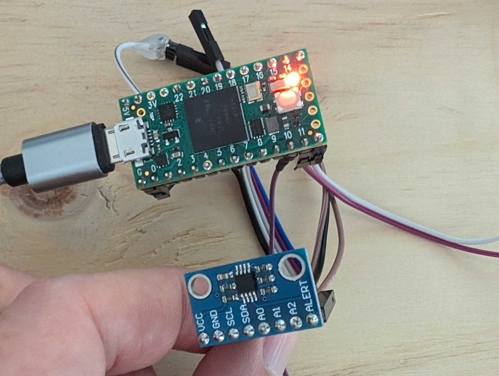

Temperature Monitor
===================
John D. Corbett  
June, 2024

Illustrates how to program a Teensy 4.0 in Rust to
   - Read a [MCP9808 temperature sensor](https://www.microchip.com/en-us/product/mcp9808)
   - Control an LED
   - Read momentary push buttons
   - Report information over USB-Serial

When the temperature exceeds a threshold, initially 30 ℃, the LED on the Teensy
4.0 lights. This temperature is a bit warmer than a typical office environment,
but a bit cooler than body temperature, so it is possible to test the system by
merely pinching the sensor between your fingers.

The threshold can be increased or decreased by a degree Celsius with two 
momentary push buttons.

Error reporting can be demonstrated by disconnecting one or more of the sensor wires.

Setup
-----



MCP9808 - Temperature Sensor
   - SCL - Teensy 4.0: 16
   - SDA - Teensy 4.0: 17
   - VCC - Teensy 4.0: 3.3V
   - GND - Teensy 4.0: G
   - A0 - Teensy 4.0: G
   - A1 - Teensy 4.0: G
   - A2 - Teensy 4.0: G

Up Button - Momentary Switch
   - 1 - Teensy 4.0: 11
   - 2 - Teensy 4.0: 12

Down Button - Momentary Switch
   - 1 - Teensy 4.0: 10
   - 2 - Teensy 4.0: 12

The Teensy 4.0 will appear at /dev/ttyACM\<_n_\> on Unix-like platforms, e.g. /dev/ttyACM0;
or /dev/cu.usbmodem\<_nnn_\> on Mac.

The Teensy 4.0 should report the temperature and threshold periodically.


Building
--------

To build the executable
```
   cargo build --target=thumbv7em-none-eabihf --release
```
See [teesny4-rs](https://crates.io/crates/teensy4-bsp) for toolchain guidance.

To convert the executable from elf to Intel hex format using
[objcopy](https://github.com/rust-embedded/cargo-binutils)
```
   cargo objcopy --target=thumbv7em-none-eabihf --release -- -O ihex t4.hex
```

To download the firmware into the Teensy 4.0 using
[Teensy Loader](https://github.com/PaulStoffregen/teensy_loader_cli)
```
   teensy_loader_cli --mcu=TEENSY40 -v -w t4.hex
```

Operating
---------

Open a terminal application on /dev/ttyACM0 (or similar for your platform). You
should see a stream of temperature readings similar to the following
```
[INFO t4_mcp9808::app]: Temperature: 27.5625 °C, Threshold: 30 °C
[INFO t4_mcp9808::app]: Temperature: 27.5625 °C, Threshold: 30 °C
[INFO t4_mcp9808::app]: Temperature: 27.5625 °C, Threshold: 30 °C
```

Pinch the sensor between your fingers. When the temperature reaches 30 ℃,
observe the orange LED on the Teensy 4.0 lights up.
```
[INFO t4_mcp9808::app]: Temperature: 28.8125 °C, Threshold: 30 °C
[INFO t4_mcp9808::app]: Temperature: 29.3125 °C, Threshold: 30 °C
[INFO t4_mcp9808::app]: Temperature: 29.6875 °C, Threshold: 30 °C
[INFO t4_mcp9808::app]: Temperature: 30 °C, Threshold: 30 °C
[INFO t4_mcp9808::app]: Temperature: 30.25 °C, Threshold: 30 °C
[INFO t4_mcp9808::app]: Temperature: 30.4375 °C, Threshold: 30 °C
[INFO t4_mcp9808::app]: Temperature: 30.625 °C, Threshold: 30 °C
```

Press the Up button connecting pins 11 and 12 of the Teensy 4.0.
```
[INFO t4_mcp9808::app]: Temperature: 26.5 °C, Threshold: 30 °C
[INFO t4_mcp9808::app]: Increased alarm theshold to 31 °C.
[INFO t4_mcp9808::app]: Temperature: 26.4375 °C, Threshold: 31 °C
```

Various error conditions can be provoked by disconnecting various wires of the
sensor breakout board or by adjusting the temperature threshold below -40 °C
or above 125 °C.

Deviation from Requirements
---------------------------

- I wasn't able to get USB-Serial input working, so I added the push buttons instead.

- I didn't have time to create a mock interface for working without actual hardware.
